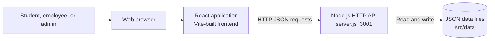

# Epaeins Application System Design

## 1. Purpose and scope

Epaeins is a web application for managing enquiry/student records, admissions,
payments, course batches, and faculty schedules. It provides sign-in and account
registration, operational data-entry screens, and summary dashboards.

This document describes the implementation currently in this repository. It
does not assume infrastructure or services that are not present in the code.

## 2. System context



The frontend and API are separate processes during development. The API listens
on port `3001` by default and can use the `PORT` environment variable to select a
different port. Frontend components currently use absolute
`http://localhost:3001/api/...` URLs.

## 3. Technology and runtime

| Area | Current implementation |
|---|---|
| Frontend | React, JavaScript/JSX, Vite |
| UI styling | CSS in `src/App.css` and `src/index.css`, with some component-level inline styles |
| API | Node.js built-in `http` module in `server.js` |
| API format | JSON over HTTP |
| Persistence | Local JSON files in `src/data` |
| Charts | CSS `conic-gradient` pie charts; no charting package is required |
| Frontend commands | `npm run dev`, `npm run build`, `npm run preview`, `npm run lint` |
| API command | `node server.js` |

There is no relational database, ORM, API framework, dedicated authentication
provider, or server-side session store in the current implementation.

## 4. Application structure

### Frontend

`src/main.jsx` mounts `App` into the document. `App` selects between the
authentication screen and the main application based on in-memory React state.
After successful sign-in, `StudentDetails` is the primary workspace.

| Module | Responsibility |
|---|---|
| `src/App.jsx` | Root component; switches between login and authenticated workspace and handles logout state |
| `src/loginform.jsx` | Sign-in and self-registration screens; calls the users API |
| `src/studentdetails.jsx` | Main enquiry list, filtering, pagination, student create/update/delete actions, and dashboard launch controls |
| `src/stddetailsform.jsx` | Student/enquiry record form |
| `src/admissiondetails.jsx` and `src/admissionform.jsx` | Admission list and admission entry |
| `src/feesdetails.jsx` | Payment entry and payment review |
| `src/running-upcoming-demo-batches.jsx` | Batch management and batch list |
| `src/facultydetails.jsx` | Faculty batch schedules and free-time entry |
| `src/data/dashboard.jsx` | Admissions and payments dashboard; enrollment analysis dashboard |
| `src/data/faculty-analytics.jsx` | Faculty analytics with status, course, and weekday pie charts |

The enrollment analysis currently imports the static `src/data/studentDetails.json`
file. The enquiry management screen, by contrast, reads its student records from
the API. Other dashboard views use API data as described below.

### Backend

`server.js` creates one Node HTTP server. It handles CORS preflight requests,
routes API requests by HTTP method and path, validates selected required fields,
and reads/writes JSON files using synchronous filesystem operations.

Each resource has local read/write helpers in `server.js`. The files are stored
under `src/data`; they are the current source of truth rather than a database.

## 5. Data model and persistence

The persisted data sets are:

| File | Main record type | Important fields and relationships |
|---|---|---|
| `src/data/authUsers.json` | User | `username`, `password`, `role`, `email`, `fullName` |
| `src/data/studentDetails.json` | Enquiry/student | `id`, `date`, `name`, `courses[]`, `qualification`, `phone`, `remarks` |
| `src/data/admissions.json` | Admission | `id`, `admissionNumber`, `joiningDate`, `name`, `course`, contact details, `status` |
| `src/data/studentPayments.json` | Payment | `id`, `admissionNumber` or legacy `studentId`, `amount`, `due`, payment dates, method, status |
| `src/data/batches.json` | Batch | `id`, `batchNumber`, `courseName`, start/end dates, time, faculty, links, class type |
| `src/data/facultyAvailability.json` | Faculty availability | `id`, `faculty`, `date`, `startTime`, `endTime`, `notes` |

Payments are associated with admissions using `admissionNumber`. The payment
list endpoint also attempts to enrich older records from admission or enquiry
records. Batch faculty assignment is stored as a faculty name, not as a
reference to a separate faculty entity. Availability records are also
keyed by the faculty name rather than by a faculty ID.

The JSON files are simple development persistence. Writes replace a complete
file synchronously; there is no transaction, locking, schema migration, backup,
or multi-instance coordination.

## 6. API surface

All current API paths are rooted at `http://localhost:3001/api`.

| Method | Path | Purpose | Notes |
|---|---|---|---|
| `GET` | `/users` | Read the user list for sign-in | The current API returns stored user objects |
| `POST` | `/users` | Register a user | Requires a username and password; defaults role to student |
| `GET` | `/students` | List enquiry/student records | Used by the main enquiry screen |
| `POST` | `/students` | Create an enquiry/student record | Validates required fields and at least one course |
| `PUT` | `/students/:id` | Update an enquiry/student record | Validates record fields and courses |
| `DELETE` | `/students/:id` | Delete an enquiry/student record | Returns 404 if the record does not exist |
| `GET` | `/admissions` | List admissions | Used by admission, payment, and dashboard views |
| `POST` | `/admissions` | Create an admission | Rejects duplicate admission numbers |
| `GET` | `/payments` | List payment details | Checks for an `x-user-role: admin` request header |
| `POST` | `/payments` | Create a payment | Validates admission, amount, and due values |
| `GET` | `/batches` | List batches | Used by batch management, faculty details, and analytics |
| `POST` | `/batches` | Create a batch | Checks date order and duplicate batch numbers |
| `GET` | `/faculty-availability` | List availability records | Used by faculty details and analytics |
| `POST` | `/faculty-availability` | Add an availability record | Requires faculty, date, and a valid time range |

Successful responses are JSON. The API uses standard HTTP response codes for
success, validation, authorization checks, missing routes/records, and server
errors. CORS currently allows all origins.

## 7. Main request and data flows

### Sign-in

1. The browser loads the user list with `GET /api/users`.
2. `loginform.jsx` compares the entered username and password with the returned
   list in the browser.
3. On a match, the user object is passed to `App`, which renders
   `StudentDetails`.
4. Logout clears the in-memory user state and returns to the sign-in screen.

There is currently no server-issued token, cookie, or session. A page refresh
returns the user to the unauthenticated screen.

### Enquiry/student management

1. `StudentDetails` fetches `GET /api/students`.
2. Search and pagination are applied in the frontend.
3. Create and edit forms submit to `POST /api/students` and `PUT /api/students/:id`.
4. Delete submits to `DELETE /api/students/:id`.
5. The server validates and writes the updated collection to
   `studentDetails.json`.

### Admissions and payments

1. Admission views read from `GET /api/admissions`; new entries use
   `POST /api/admissions`.
2. Payment entry validates against admission data and submits to
   `POST /api/payments`.
3. The admissions/payments dashboard loads admissions and, for an admin view,
   requests payment details from `GET /api/payments`.
4. The server enriches payment records using admissions and enquiry records
   where possible.

### Faculty schedules and analytics

1. Faculty details and analytics each load `/api/batches` and
   `/api/faculty-availability`.
2. Faculty details filters records by the selected faculty and supports adding
   batches and availability entries.
3. Faculty analytics derives batch status from start/end dates, groups batches
   by course, groups availability by weekday, and calculates recorded available
   hours in the browser.

## 8. Authorization and current limitations

The current access model is suitable only as a local development prototype:

- User credentials are stored in plain text in `authUsers.json`.
- Sign-in verification is performed in the browser after fetching the user
  list; the server does not authenticate the user.
- Registration accepts a role supplied by the client, and the UI offers
  student, employee, and admin choices.
- The payment-list endpoint checks a caller-supplied role header, not a
  server-verified identity.
- Other data endpoints do not enforce authenticated identity or role-based
  access at the API boundary.
- CORS is configured to allow any origin, and the frontend API URL is fixed to
  localhost.

Before handling real users or production data, replace this model with
server-side authentication, hashed passwords, server-validated authorization
for every protected resource, restricted CORS, HTTPS, secure secret/config
management, and a managed database. Registration should not grant privileged
roles directly from client input.

## 9. Deployment and operations

For local development, run the API and frontend in separate terminals:

```powershell
node server.js
npm run dev
```

The API defaults to port `3001`. Vite provides the frontend development server
and production build. `npm run build` generates static frontend assets in
`dist`; `npm run preview` serves that build for local preview. The repository
does not currently define an API start script, production hosting setup,
reverse proxy, deployment pipeline, or production database.

Operational considerations for a production design include structured logs,
health checks, environment-based API configuration, backups, data migration,
concurrent-write handling, monitoring, and recovery procedures.

## 10. Suggested future evolution

1. Introduce server-owned authentication and role-based authorization.
2. Move user, admission, payment, enquiry, batch, and availability records to a
   transactional database with explicit schema and relationships.
3. Centralize API URL/configuration and validate request and response shapes.
4. Replace static enrollment-dashboard input with the same live source as the
   enquiry screen, if live analytics are required.
5. Add API, component, and end-to-end tests for validation, permissions, and
   the principal workflows.
